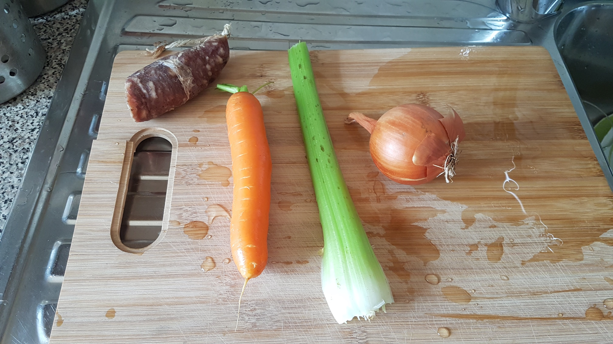
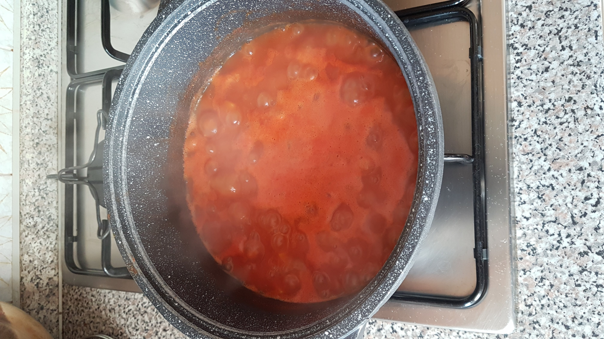
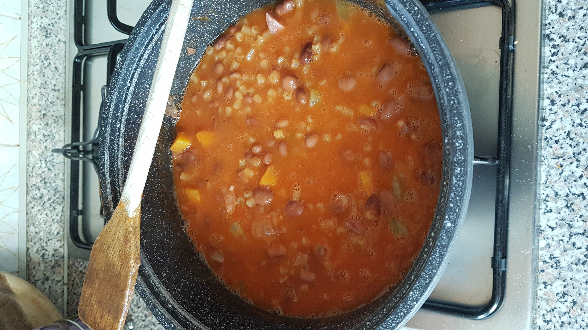
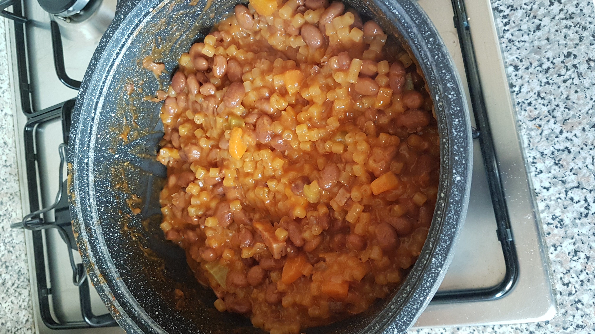

# Pasta e fagioli

**[Pasta e fagioli](https://en.wikipedia.org/wiki/Pasta_e_fagioli)** , meaning "pasta and beans", is a traditional italian dish, started as a paesant dish, being composed of inexpensive ingredients.

## Ingredients

Ingredient for about 4 peoples:

- Salt
- Half onion
- A piece of celery
- A carrot
- A piece of sausage
- Tomato sauce or tomato concentrate
- Two borlotti beans cans
- Ditalini (small thimbles)
- Olive oil

## Recipe

Clean well whit cold water the vegetables. Chop the onion, the celery, and the carrot in little pieces. Cook the onion, celery and carrot in the pot with a little bit of olive oil. 

Meanwhile cut in little pieces a piece of sausage and add it in the pot.

When the "sofritto" is *goldenish*, add some tomato sauce as much as need to cover the sofritto (or a spoon of tomato concentrate), and salt.

Wait a couple of minute and add the beans (about 500-700 grams). Add water as much as need to cover all the beans. Wait a couple of minutes to permits a little bit of water to evaporate.

Then add Ditalini (about 80 gr for every people) and wait the pasta cooking time. Check the salt and if necessary add it.

When the pasta is ready and creamy, turn off the fire, check the salt and add some oil.

The dish is ready.

